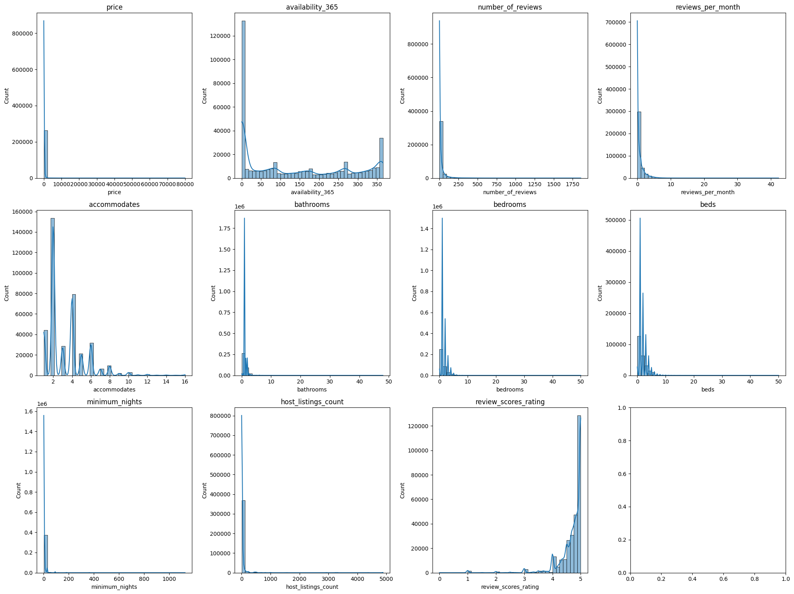
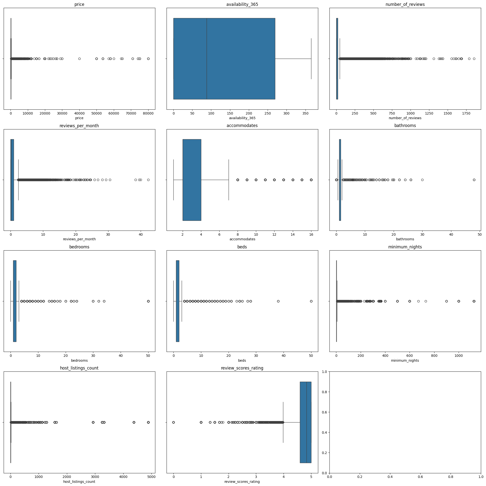
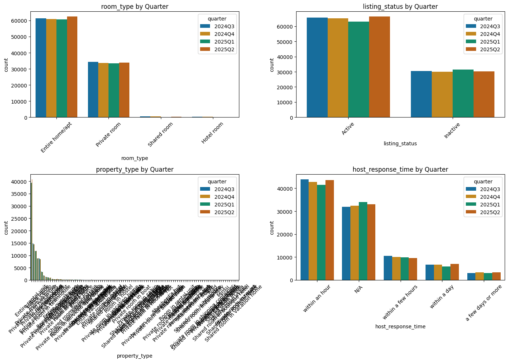
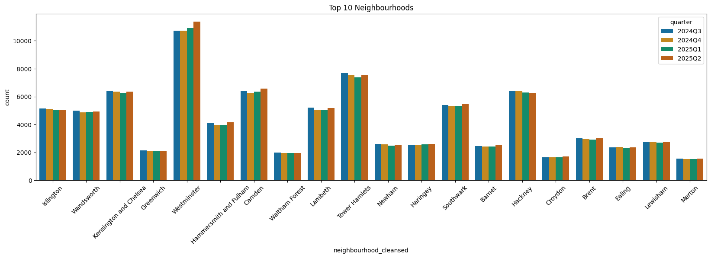

# Market Dynamics & Revenue Driver Analysis – London Airbnb

##  Repository Structure
```
airbnb-london-analysis/
│
├── data/
├── images/
├── 01_data_cleaning_explained.ipynb
├── 02_eda_and_business_insights.ipynb
├── main.py
├── data_cleaning.py
├── sql_data_loader.py    
├── requirements.txt
└── README.md
    ├── Repository Structure
    ├── Business Problem
    ├── Dataset
    └── Methodology
              ├── 1. Data Extraction (Getting data from a source (SQL Server))
              ├── 2. Data Cleaning & transformation
              │       ├──2.1 Data Cleaning
              │       └──2.2. Feature Engineering
              ├── 3. Load (Push cleaned & transformed dataset back into SQL Server)    
              ├── 4. Exploratory Data Anlaysis (Plotting Histoograms ,box plot, countplot etc)
              └── 5. Business Insights & Recommendations
                     ├──5.1 Link to vist Tableau Dashboard https://public.tableau.com/shared/CQP35GGCQ?:display_count=n&:origin=viz_share_link
                     └──5.2 Business Insights 

```
## Business Problem
Airbnb hosts in London face seasonal dips in occupancy and pricing, with limited visibility into which property types, neighborhoods, reviews, and superhost status drive bookings.  
This project analyzes London Airbnb listings to design KPIs and dashboards that enable data-driven decision-making.
The objective of this project is to analyze revenue performance and demand concentration across Airbnb listing segments defined by Room Type , Property Type, neighbourhood, quarter.

Using listing-level pricing and availability data, 

The goal of this analysis is to answer the following business questions:
### 1. Which Room Type × Property Type combinations perform the best?
- Identify top-performing listing configurations.
- Understand pricing trends across quarters.
- Determine whether revenue changes are driven more by pricing strategy or demand fluctuations.

### 2. Does occupancy directly drive revenue performance?
- Estimate occupancy using availability data.
- Analyze the relationship between occupancy and revenue.
- Understand whether higher occupancy consistently leads to stronger revenue.

### 3. How does revenue behave across quarters?
- Estimate quarterly revenue using price × occupancy proxy.
- Identify peak and weak demand cycles.
- Understand revenue seasonality for better forecasting and planning.
(Price reflects supply strategy, occupancy reflects demand — revenue captures the combined effect.)

### 4. Is revenue diversified or concentrated across room types?
-	Which room types generate the highest revenue while maintaining strong occupancy?
-	Is revenue spread across segments or concentrated in specific room types?
This helps:
-	Identify primary revenue drivers.
-	Guide investment and marketing allocation.
- Reduce dependency on limited segments.

### 5. Which exact listing configurations drive marketplace performance?
-	Analyze performance at a granular level (Room Type × Property Type).
-	Identify high-performing supply categories.
-	Support optimized host onboarding for specific property–room combinations.

### 6. Does revenue follow the 80/20 (Pareto) principle?
-	Check whether the top 20% of listing combinations generate ~80% of total revenue.
- Measure revenue concentration risk across segments.

### 7. Is marketplace performance geographically concentrated?
-	Which neighbourhoods drive the highest revenue and occupancy?
-	Are strong-performing areas limited to tourist-heavy zones?
This helps:
-	Identify areas with higher pricing power
-	Detect expansion opportunities in mid-tier neighbourhoods
-	Support strategic supply growth.

### 8. How do host characteristics impact revenue?
-	Analyze the impact of host response time and host experience on revenue.
-	Understand whether better host quality leads to higher monetization.
This supports:
-	Host acquisition strategy
-	Host retention focus
-	Marketplace quality improvement


## Dataset
- Source: Inside Airbnb dataset (publicly available).
- Size: ~500K listings (sample dataset included in `data/` folder for reproducibility).
- Key fields: price, availability, occupancy, property type, neighborhood, reviews, superhost status.
  
#  Methodology

## 1️. Data Extraction

The dataset was extracted directly from **SQL Server** using `SQLAlchemy` and `pyodbc`.
A structured SQL query was used to create a consolidated `airbnb_summary` dataset containing listing-level, host-level, pricing, availability, and review attributes for all 4 quarters.

This help ensured:

* Centralized data logic
* Reproducibility
* Clean integration between SQL and Python analytics

## 2️. Data Cleaning & Transformation
## 2.1 Data Cleaning
A structured missing value computation was performed:

* Computed NaN count and percentage of NaN per column.
* Identified columns with systematic missing patterns.

### Host Information Handling

* Verified that host-related attributes like host_since,host_response_time,host_response_rate,host_acceptance_rate,host_listings_count
,host_total_listings_count,host_identity_verified were missing together/ not randomly missing .
* Created:
  host_info_missing_flag to capture structurally incomplete host profiles.
* Standardized  columns -> 'host_since','host_acceptance_rate','host_response_rate','host_listings_count','host_total_listings_count' missing values as `"unknown"`

### Review Data Handling
* columns -> review_scores_accuracy,review_scores_cleanliness,review_scores_checkin,review_scores_communication,review_scores_location,review_scores_value
* Verified that review-related columns were missing together
* Created:
  "no_reviews_flag"
* Imputed `reviews_per_month` with 0 for listings with no reviews(NaN).

### Bathroom & Bedroom Cleaning
* Columns -> Beds, bathrooms,bathrooms_text, bedrooms
* Parsed numeric values from `bathrooms_text`
* Converted `bathrooms` to numeric
* Imputed NaN in: 
  * Bathrooms -> Median
  * Bedrooms -> Median within `property_type and bedroom`
* Dropped redundant `bathrooms_text` column

### column - Beds

* Imputed missing values in beds using median

### column Price Cleaning 
* Price is Not Missing at Random (NMAR)
* Removed currency symbols and commas
* Converted to numeric format
* Investigated missing price patterns relative to availability
   * **Combination_1** (Active lIstings) price = Nan ,has_availability = False ,and all availability_30,availability_60,availability_90,availability_365 as > 0 values
   * **Combination_2** (Blocked/Inactive) with Price= Nan ,has_availability = True ,and all availability_30,availability_60,availability_90,availability_365 as 0 values
   * **Combination_3** (Inactive) with price = NaN, has_availability = false , and all availability_30,availability_60,availability_90,availability_365 as 0
   * **Combination_4** (Unknown/Inactive) with price = NaN, has_availability = NaN, and all availability_30,availability_60,availability_90,availability_365 vary ( >0)
* **Impute Missing Prices for active listings or Combination 1** : Impute using  a hierarchy of medians:Group median by room_type  + neighbourhood_cleansed
### Data Quality & Supply Reality Insight
- ~35% of listings had missing prices.
- Investigation revealed that many were:
- Blocked calendars
- Inactive listings
- Scrape gaps
- Only truly active listings were imputed.
***Insight: Raw listing count overstates active supply. True revenue analysis must filter functional listings.***

### Creating column "listing_status"
* np.where(airbnb_summary["availability_365"] > 0,"Active","Inactive")
---

## 2.2. Feature Engineering

To support business analysis, several derived metrics were created.

### Occupancy Proxy (30-Day Window)

Since booking-level data was unavailable, availability was used as a demand proxy:
```
Occupancy Rate (30-day) = 1 − (availability_30 / 30)
```
Values were clipped between 0 and 1.
This acts as a demand intensity indicator.

### Revenue Proxy (Quarterly Estimate)

Revenue was approximated using:
```
Revenue Proxy (Quarterly) = price × occupancy_rate_30 × 90
```
 This provides a standardized performance measure across listings.

## 3. Load

Push cleaned & transformed dataset back into SQL Server

Store as new table (airbnb_listings_cleaned).


### Active Listing Filtering each time we try to answer a business problem

Only active listings were retained:

* Non-null price
* Non-null availability_30

  This ensures realistic revenue estimation.
---

## 4. Exploratory Data Anlaysis (Plotting Histoograms ,box plot, countplot etc)






**Insights :**
- number_of_reviews - Few listings have 1000+ reviews, a small subset of listings dominate review activity (likely high booking volume).
- reviews_per_month - is heavily right-skewed suggesting few listings have high reviews (high activity probably)
- availibilty_365- Many listings are vailable almost all year.
- Acommodates - Most liistings accomodate 2-4 ,Market is primarily small group oriented.
- host_listings_count- is heavily skewed ,most host have listings in thousands some have fewer listing too suggesting (individual and commercial hosts).
- review_scores_rating- Most ratings are toward 4.5 -5.0 .

- Most of numeric variables exhibit right-skewed behaviour.
with heacy presence of outliners.For analysis its better to use medain over mean.



**Insights :**
- London airbnb market is heavily skewed towards entire homes/apt indicating strong demand for full unit share rather than shared accomodation .
- Majority of listings are active throughout the quarters .
- Service quality indicator - There are large number of hosts that respond within an hour indicating high booking conversion rates .



***Airbnb supply(listings) concentrated and how is it changing over time/ Market place structure Insights:***
- Westminster has highest number of listings. Also westminster has increased listing count in quarter 2 maybe because its peak season .We'll investigate this further.
- Then Tower Hamlets,Camden.
- Suggest supply is highly concentrated in a few central boroughs.
- Moreover ,in bouroughs with high supply ,hosts compete more,rating and pricing strategy matter more.
  
🔗 Live Interactive Dashboard:


**Insights :**
- From the correlation ,we didn't get to know any significant correlation between numeric variable.

---
## 5. Business Insights & Recommendations
***Clink Link to Visit Dashboard***
https://public.tableau.com/shared/CQP35GGCQ?:display_count=n&:origin=viz_share_link
### 1. Pricing Trend Across Quarters

Median nightly prices remain relatively stable (~£130–£135).

A dip is observed in Q1, indicating possible winter demand softness.

Pricing does not fluctuate aggressively across quarters.

Revenue variation is therefore more likely driven by occupancy changes rather than pricing behavior.

***Insight: Revenue seasonality appears demand-driven, not price-driven.***

###  2. Occupancy as a Revenue Driver

Occupancy varies significantly across quarters.

Listings with higher occupancy consistently generate higher revenue.

Price stability combined with occupancy fluctuation confirms demand seasonality.

***Insight: Occupancy is the primary short-term driver of revenue performance.***

### 3. Revenue Seasonality

Quarterly revenue shows clear seasonal cycles.

Stronger performance in peak quarters.

Weaker performance in winter months.

***Insight: Clear peak and weak demand cycles exist — useful for seasonal forecasting and pricing strategy planning.***

### 4. Revenue Contribution by Room Type

A few room types (especially Entire Home/Apartment) contribute the majority of revenue.

Private rooms contribute lower revenue despite high listing counts.

Revenue is concentrated in specific room types rather than evenly distributed.

***Insight: Marketplace performance is highly dependent on specific supply categories.***

### 5. Room Type × Property Type Combinations

Certain combinations (e.g., Entire Home × Apartment) dominate revenue.

Many other combinations form a long tail with minimal contribution.

Performance varies significantly at granular configuration level.

***Insight: High-performing supply categories should be prioritized during host onboarding and expansion.***

### 6. Pareto (80/20) Principle

A small percentage of listing combinations contribute the majority of revenue.

Revenue concentration follows a Pareto-like distribution.


***Insight: Marketplace revenue is concentrated — diversification opportunities exist to reduce dependency risk.***

### 7. Neighbourhood-Level Concentration

Revenue and occupancy are geographically concentrated.

High-performing neighbourhoods show:

Higher pricing power

Strong occupancy

Several mid-tier neighbourhoods show expansion potential.

***Insight: Demand is clustered in premium tourist zones, but there is room for strategic expansion.***

### 8. Host Response & Experience Impact

Listings with faster host response times tend to perform better.

Verified and experienced hosts show stronger revenue performance.

Missing host information strongly correlates with lower activity or inactive listings.

***Insight: Host quality and responsiveness contribute to revenue performance — suggesting value in host quality management and retention strategies.***

